#####<h5 id="GaussianJob">Register Gaussian Application</h5>
End of this tutorial you will know how to register a new application to run on a a HPC resource through Django portal.

1. Navigate to Settings &rarr; Application Catalog. Click New Application +
2. In Details tab enter:
    - Enter Application Name: Gaussian16
    - Enter Application Version: Gaussian 16 (Not mandatory)
        - Enter Application Description: Gaussian provides capabilities for electronic structure modeling
    - Save
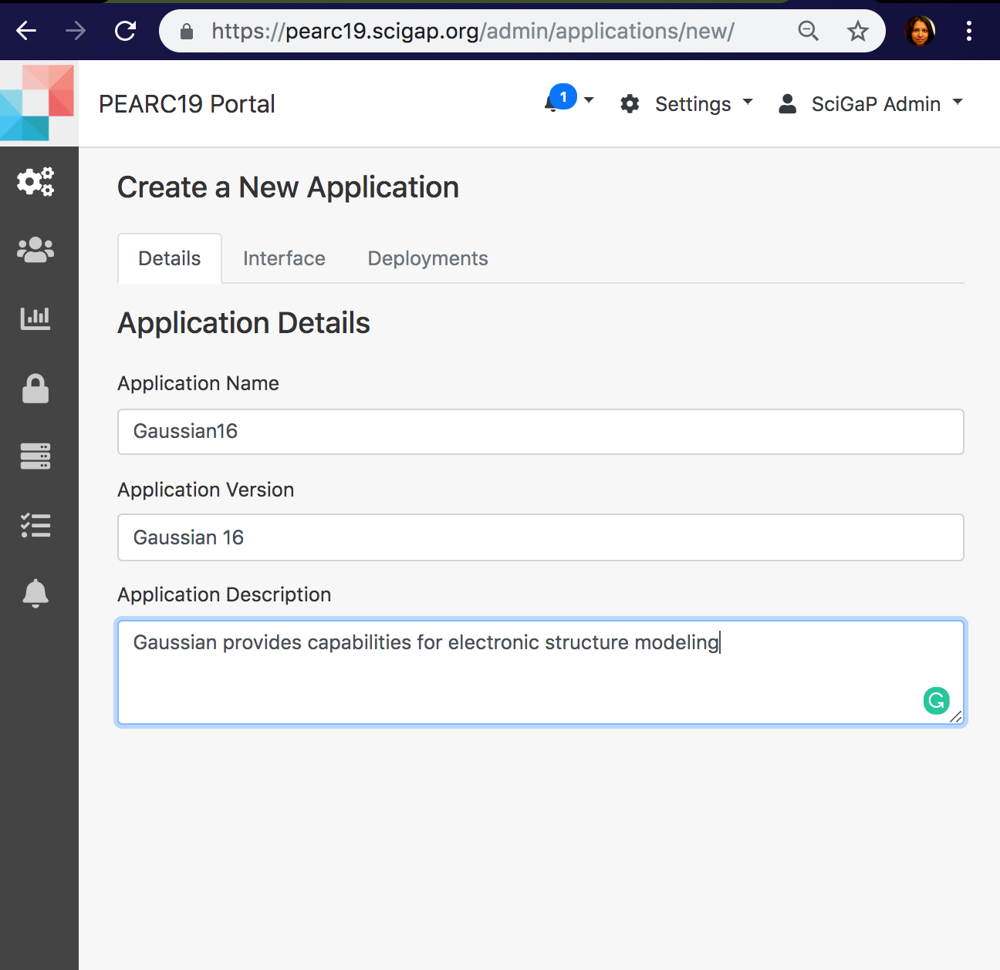
3. In Interface tab:
    - Set 'Enable Archiving Working Directory' to True (Why? - This is set to true when you want to bring back all the files in working directory back to PGA. Caution: If there are very large files they may not be able to SCP)
    - Set 'Enable Optional File Inputs' to False (Why? - Set to false because there won't be any additional optional inputs for Gaussian)
    - Provide Input Fields
        - Click Add Application Input
        - Name: Input-File
        - Initial Value: gaussian.com
        - Type: URI (Why? - This is the type for file uploads)
        - Application Arguments:
        - Standard Input: False (Why? - Futuristic property and not in real use at the moment)
        - Read Only: False (Why? - this is only meaningful for String, Integer or Float inputs)
        - User Friendly Description: Gaussian input file specifying desired calculation type, model chemistry, molecular system and other parameters. (This is information to the user at creating job experiment. Not mandatory)
        - Data is Staged: False
        - Is the Input Required: True
        - Required in Commandline: True
        - Advanced Input Field Modification Metadata:
    - Provide application outputs 
    NOTE: 3 application outputs to define.  
        - 1st Output
            - Click Add Application Output
            - Name: Gaussian-Application-Output
            - Value: *.log
            - Type: URI
            - Application Argument:
            - Is the Output required?: True
            - Required on command line?: True
            - Metadata: 
        - 2nd output
            - Click Add Application Output
            - Name: Gaussian_Checkpoint_File
            - Value: *.chk
            - Type: URI
            - Application Argument:
            - Data Movement: False
            - Is the Output required?: True
            - Required on command line?: True
            - Metadata
        - For applications, STDOUT and STDERR will be automatically added for you.
            - Search Query: 
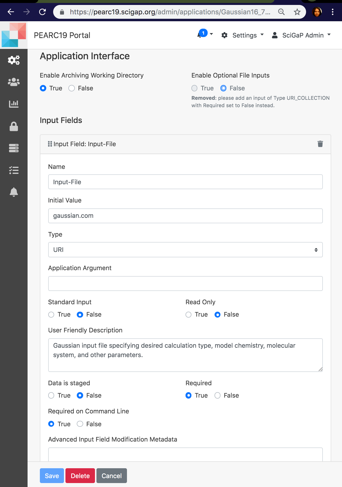
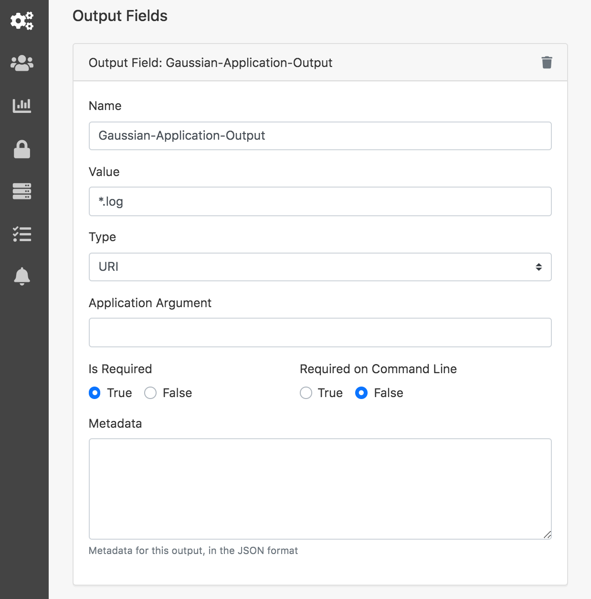
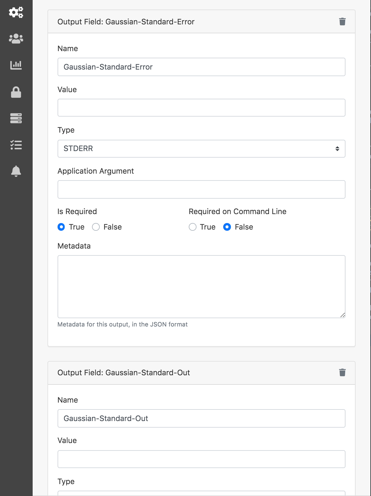
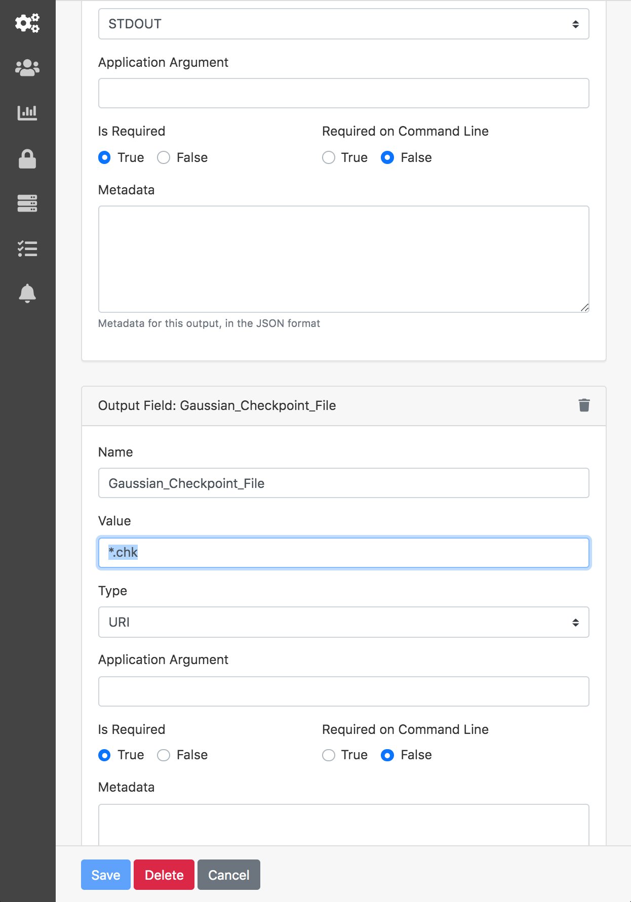
  
3. In Deployment tab
    - Click 'New Deployment +'
        - Click Share and add groups and users you want to share this deployment and let run on the particular cluster.
        - Application Executable Path: /home/gridchem/bin/rung09_with_chk_recovery.sh
        - Application Parallelism Type: SERIAL  
        - Application Deployment Description: Gaussian16 Rev A.03 ( to avoid G4 output printing issues in Rev B.01)
        - Application Compute Host: Local (Local machine has to be added as a compute resource prior to this step)
        - Add Module load commands: 
            - <pre><code>#SBATCH -N 1</code></pre>
            - export MODULEPATH=/share/apps/compute/modulefiles/applications:$MODULEPATH; module load gaussian/16.B.01
        - Pre Job Commands:
            - export AIRAVATA_USERNAME=$gatewayUserName
            - export AIRAVATA_INPUTS=$inputs
            - export AIRAVATA_ExptDataDir=$experimentDataDir;
        - Default Queue Name: shared
        - Default Node Count: 1
        - Default CPU Count: 4
        - Default Walltime: 30
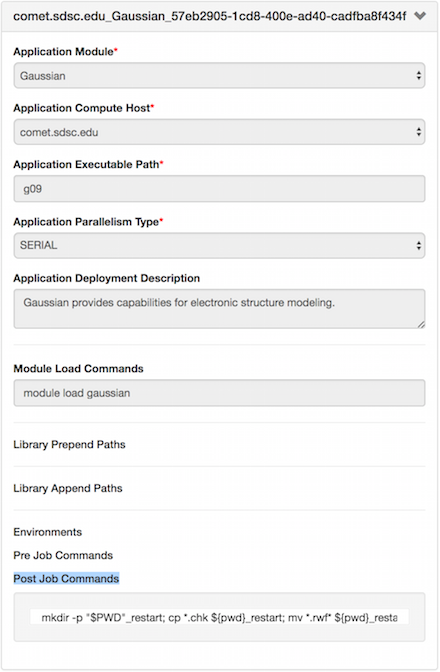

## Django Gateway Theme Management
In Django portal, the gateway branding or the theme is managed through a CMS. The Djangop portal uses WagTail CMS for the theme. 
The CMS takes care fo the gateway home page, child pages content.  
Gateways are initially deployed with a common base theme, but the gateway admins can re-brand according to their needs. 
In order to change the theme user needs to be in the Admin group. 

### Instructions on Gateway Theme
NOTE: For details instructions please refer <a href="https://github.com/apache/airavata-django-portal/blob/master/docs/cms.md" target="_blank"> Github CMS Instructions</a>

1. Login to your gateway portal.
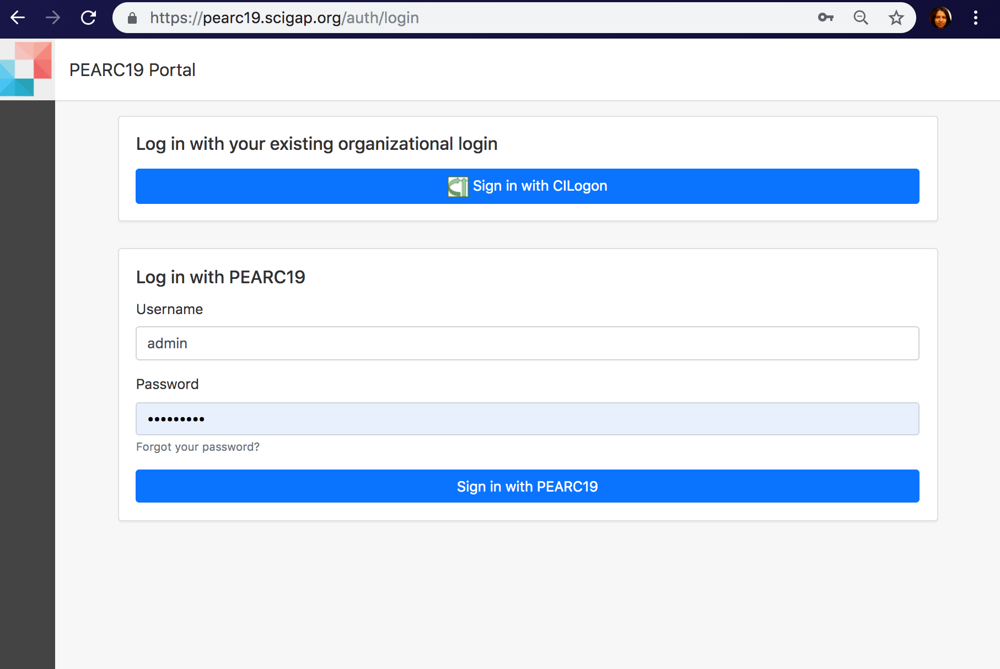   

2. Once logged in navigate to Home page.
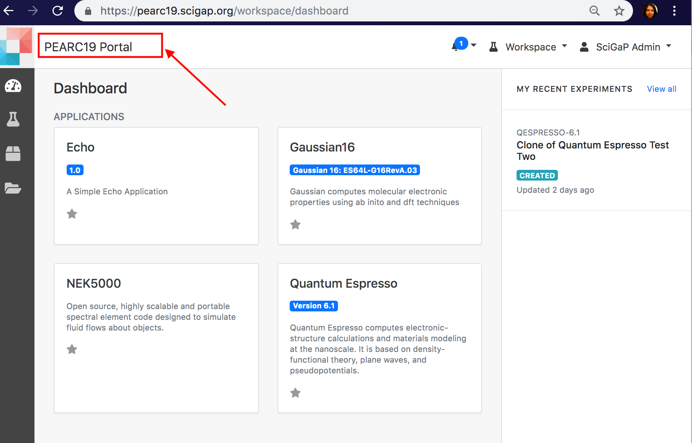  

3. Click on the Wagtail icon → Go to Wagtail Admin
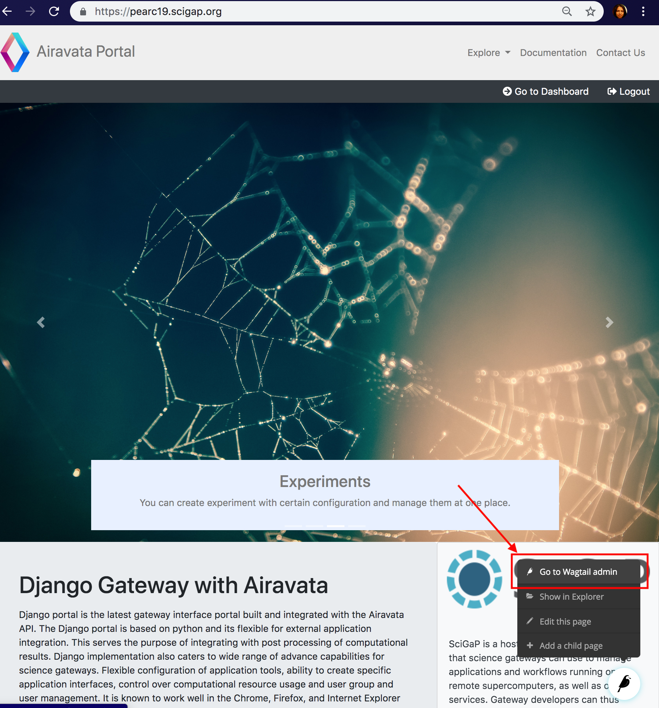  

4. You are no in Wagtail CMS
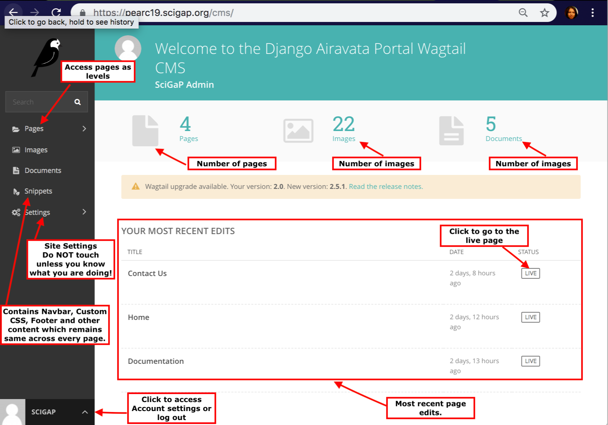  

5. To create a new child page or to edit the existing Home page, navigate to Pages, on left.
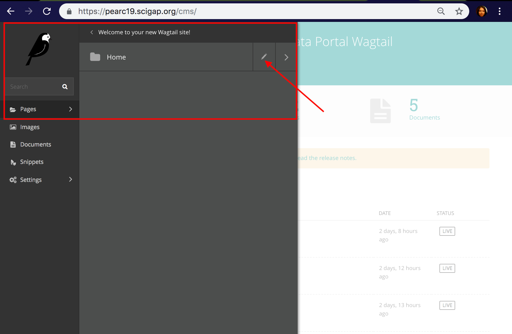  

6. Keep using the arrow and navigating until the page you want to edit appears in the list. To edit the Home page, use the right arrow and then click on Home or the pen icon.
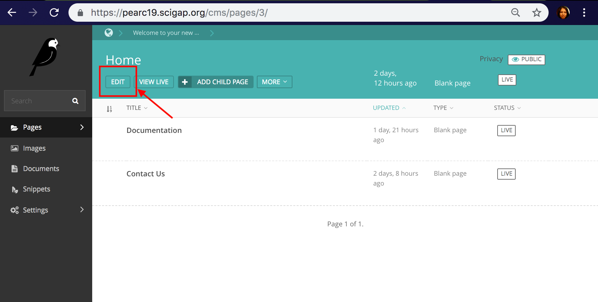  

7. Once the changes are done, Save as a draft or Publish or Preview from options at the bottom.
8. If you want to create a page as a child page of Home page, Click on the Pages link on the left side-bar.
9. You will get a side pop-up which will contain "Welcome to your new Wagtail Site" and a "pencil" icon and a "right-arrow" icon.
10. You will get "Home" Link. This is the default page. If you want to modify it you can click on "pencil" icon. if you already have any child pages to "Home", you will also be able to find a "right-arrow" icon
11. To create a new page as a child of "Home". you need to click on "Home" Link.
12. Then Click on "ADD CHILD PAGE" link.
13. Choose a page template type. Currently, three of them are available.
    - Blank Page -> (Build a page from scratch (Best Way))
    - Cybergateway Home Page -> (Build an IU Themed Home Page)
    - Home Page -> (Build a seagrid website based Home page)
14. Each page has four tabs namely:
    - CONTENT (On page load)
    - CUSTOMIZATION
    - PROMOTE
    - SETTINGS
15. Provide a title(required) for the page so that you can see it in the CMS.
16. Head over to the PROMOTE Section.
    - Provide a slug url ( which is the url extension at which the page will be available). for example if you are creating a documentation page. Provide a slug like documentation so that when you visit <--yourwebsite.com-->/documentation you will visit this page.
    - Provide a Page Title. This will show up in the page title of each page.
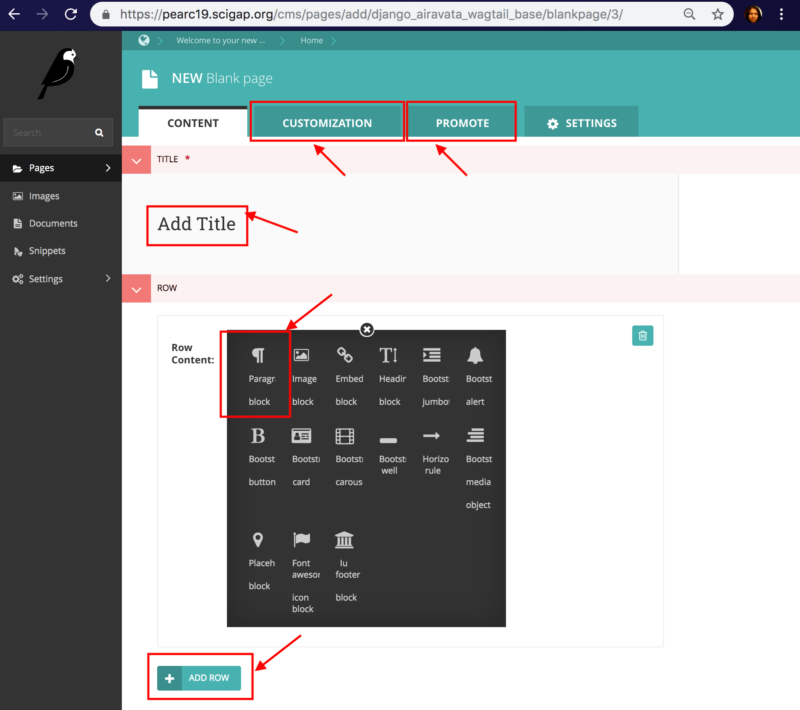    

17. Once the changes are done, you can preview, publish or save as a draft.

 

