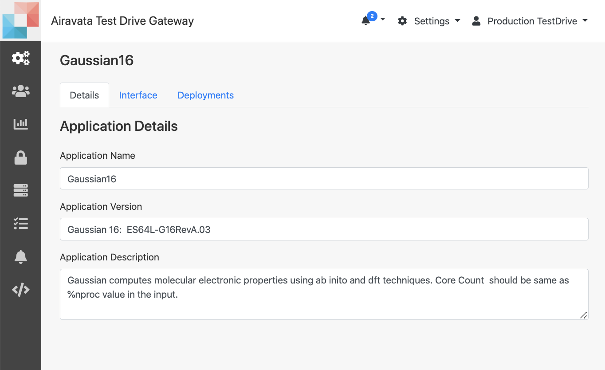
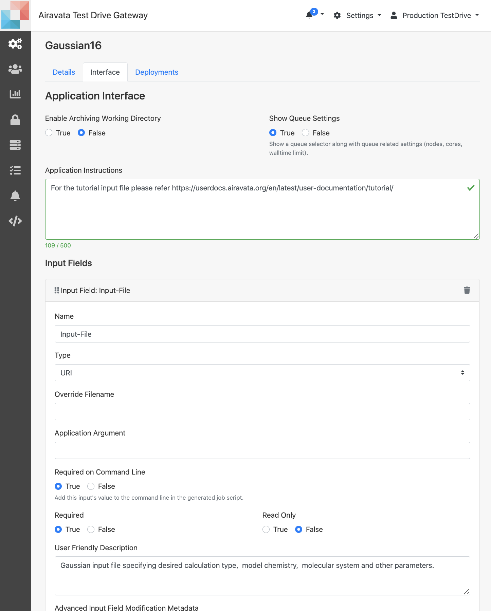
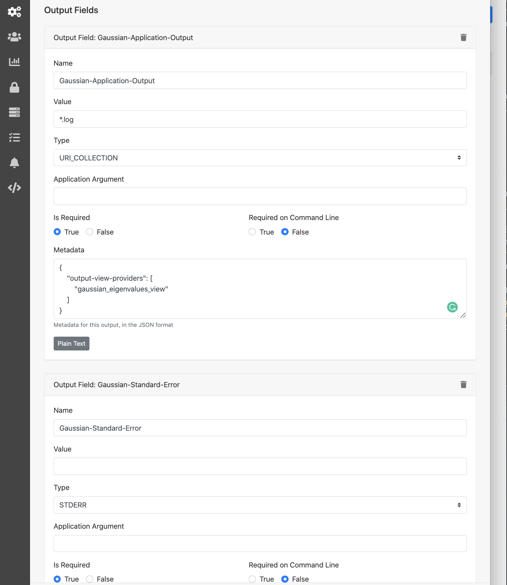

## Application Catalog

- Available actions on Experiments
    - <a href= "#Gaussiangen">Introduction</a></br> 
    - <a href= "#Gaussianapplication">Add Gaussian16 Details</a></br> 
    - <a href= "#gau16interface">Add Gaussian16 Inputs and Outputs</a></br>
    - <a href= "#gau16dep">Add Gaussian16 Deployment</a></br>
    - <a href= "#edit">Edit</a></br>
    - <a href= "#launch">Launch</a></br>
    
#####<h5 id="Gaussiangen">Introduction</h5>
- _**Application Catalog**_ is where you will add your gateway applications/tools/codes for gateway users to consume.
- Application/tool/code is what you create in the gateway, which will have all the configurations required to execute the actual code in the  remote resource.
- Configuring an _Application_ is a three step process. You would;
 - First add the main _Details_ of the application
 - Next its the _Interface_, where you would add all the input required to execute application and also the outputs that the gateway should bring back for the user.
 - Last is the _Deployment_, Which is the place you will add all the commands that are needed to execute the application in the remote resource.

- Gateway admins can;
    - Create new applications
    - Test the application with job submissions
    - Edit existing applications
    - Delete applications no longer needed
    
NOTE: In order to explain how an application could be added to the gateway, we would take Gaussian16 application as the example. 

#####<h5 id="Gaussianapplication">Add Gaussian16 Details</h5>

1. **Settings** &rarr; **Application Catalog** &rarr; **New Application +**
2. In Details tab:
    - Application Name: _Gaussian16_
    - Application Version: _Gaussian 16:  ES64L-G16RevA.03_ (Optional)
    - Application Description: Gaussian computes molecular electronic properties using ab inito and dft techniques. Core Count  should be same as %nproc value in the input. (Optional)
    - Save

<ADD>------

Image:Adding Gaussian16 Details

#####<h5 id="gau16interface">Add Gaussian16 Inputs and Outputs</h5>
1. **Settings** &rarr; **Application Catalog** &rarr; **Gaussian16** &rarr; **Interface**
2. In Interface tab:
    - Set _Enable Archiving Working Directory_ to `True` (Why? - This is set to true when you want to bring back all the files in the remote working directory back to the gateway portal. Caution: Gateway has a size restriction on ARCHIVE. Please contact SciGaP admins for more details.)
    - Set _Show Queue Settings_ to `False` - This is your gateway preference. If you gateway users are not give the option of changing the queue properties when submitting jobs, you can hide this and have same properties set for all the users.
    - Provide Input Fields
        - Click _Add Application Input_
        - _Name_: `Input-File`
        - _Initial Value_: `gaussian.com` (This is if you want to override the input names given by the user, if not leave it empty)
        - _Type_: `URI` (Why? - This is the type for file uploads)
        - _Application Arguments_: NULL
        - _Required in Commandline_: `True`
        - _Required_: `True`
        - _Read Only_: `False` (Why? - this is only meaningful for String, Integer or Float inputs)
        - _User Friendly Description_: Gaussian16 input file specifying desired calculation type, model chemistry, molecular system and other parameters. (This is information to the user at creating job experiment. Optional)
        - _Advanced Input Field Modification Metadata_: NULL (Why? - This is used mostly for advance string input options. For more information refer: [Advance Application Inputs](advance-inputs.md)
        
<br>
NOTE: For this application, only a single input, and its a file. For applications, there can be multiple inputs and different input types, such as String, Integer or multiple files.
    - Provide application outputs</br>
    NOTE: 4 application outputs to define. </br>
        - 1st Output
            - Click _Add application output_
            - _Name_: `Gaussian-Application-Output`
            - _Value_: `*.log`
            - _Type_: `URI_COLLECTION`
            - _Application Argument_: NULL
            - _Is Required_: `True`
            - _Required on Command Line_: `True`
            - _Metadata_: 
            <div>
            ```
            json
            {
                "output-view-providers": [
                    "gaussian_eigenvalues_view"
                ]
            }
            ```
            </div>

        - 2nd output
            - CLick _Add Application Output_
            - _Name_: `Gaussian_Checkpoint_File`
            - _Value_: `*.chk`
            - _Type_: `URI_COLLECTION`
            - _Application Argument_: NULL
            - _Is Required_: `True`
            - _Required on Command Line_: `True`
            - _Metadata_: NULL
        - For applications, STDOUT and STDERR will be automatically added for you.


Image: Gaussian16 Inputs and Outputs

#####<h5 id="gau16dep">Add Gaussian16 Deployment</h5>
1. **Settings** &rarr; **Application Catalog** &rarr; **Gaussian16** &rarr; **Deployment**
2. In _Deployment_ tab
    - Click _New Deployment +_
        - Select _Expanse_
        - _Share_ button: Add groups and users you want to have access to this deployment. Meaning, who can submit Gaussian16 jobs to Expanse
        - _Application Executable Path_: `/home/gridchem/bin/rung09_with_chk_recovery.sh`
        - _Application Parallelism Type_: `SERIAL`
        - Application Deployment Description: Gaussian16 Rev A.03
        - Module Load Commands: 
            - <pre><code>#SBATCH -N 1</code></pre>
            - export MODULEPATH=/share/apps/compute/modulefiles/applications:$MODULEPATH; module load gaussian/16.B.01
        - Pre Job Commands:
            - export AIRAVATA_USERNAME=$gatewayUserName
            - export AIRAVATA_INPUTS=$inputs
            - export AIRAVATA_ExptDataDir=$experimentDataDir;
        - Default Queue Name: shared
        - Default Node Count: 1
        - Default CPU Count: 4
        - Default Walltime: 30
        - Save


Image: Gaussian16 Deployment

#####<h5 id="Otherappdetails">Other Application Catalog Details </h5>
1. An Application can have multiple deployment, each deployment is for each remote resource the gateway wants to submit jobs to.
2. When sharing application, deployment you would only share it with gateway user who you want to use it.
3. Tip: When you are adding a new application, you can keep it without sharing it with gateway users until you test it. Unshared applications will appear grayed out to gateway uses.


 


