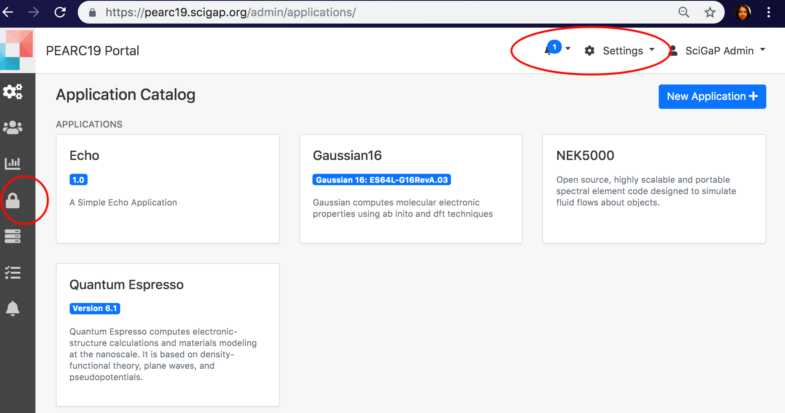

    
    
    
##### <h5 id="Secure">Using Credential Store</h5>
1. Navigate to Settings &rarr; Credential Store.
2. Click 'New SSH Credential +' and provide a key description.
3. The new key will be generated and available to copy.
4. Apart from using the key for SSH communications with compute resources and gateway storage resource, you can share the key with other gateway users and user groups.
5. When sharing a key, there are 3 permission levels, READ, WRITE and MANAGE_SHARING. 
6. READ permission enables the users to use the key, WRITE permission enables using the key plus deleting the key. MANAGE_SHARING is use the key, delete it and also share with other users and user groups behalf of the owner of the key.
7. NOTE: Make sure not to delete once assigned to a compute resource or the storage resource.  
