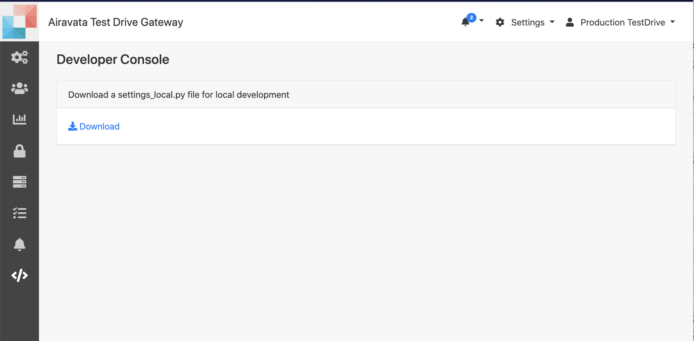

## Developer Console 

1. This is for gateway developers (Who should have admin access) can download the properties file to set up local Django Portal development environment.

Image: Developer Console 
