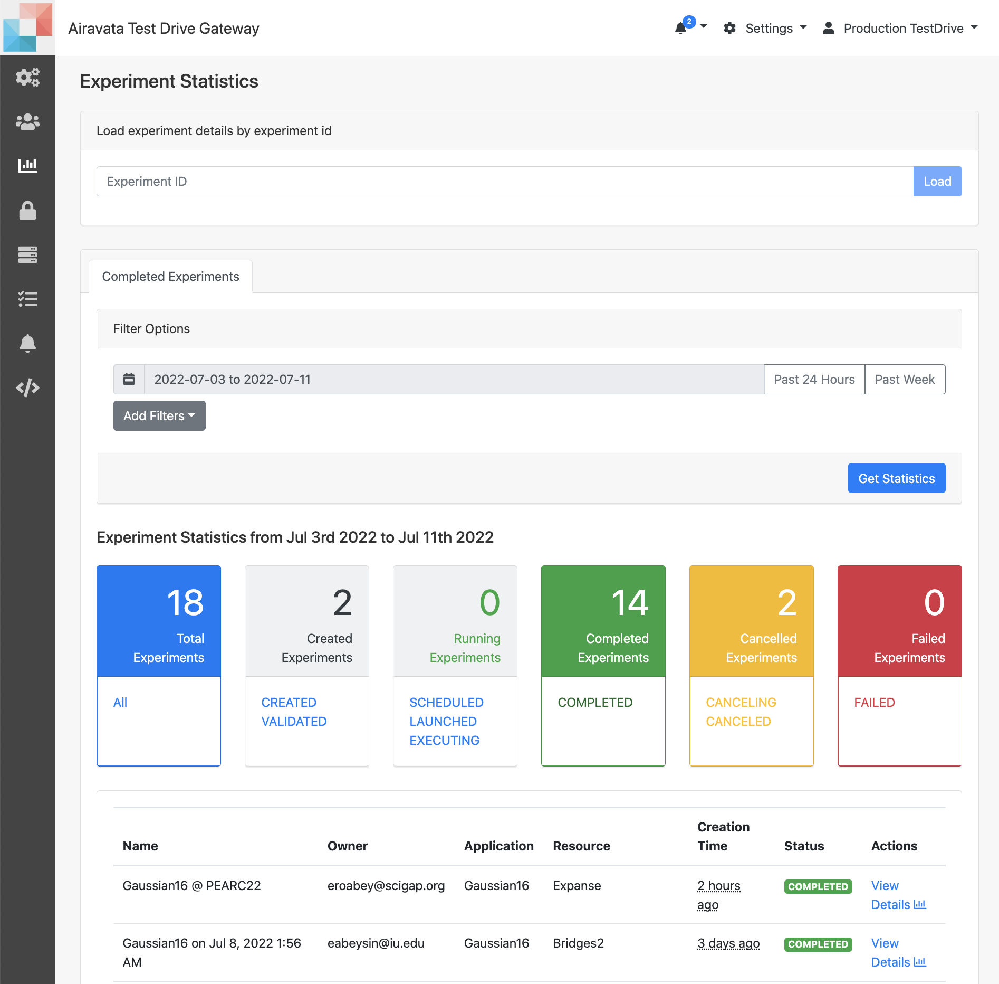
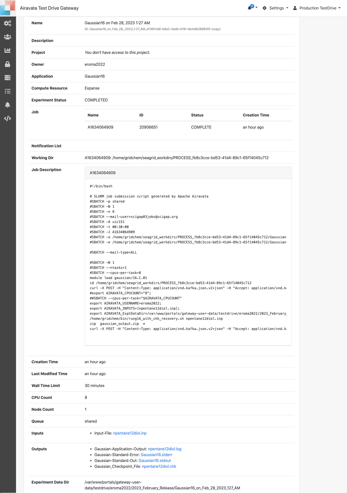

##Experiment Statistics for Monitoring  

##### Monitor Gateway Traffic
1. Monitor current gateway experiment and job statuses through Settings &rarr; Experiment Statistics.
2. Gateway admin can view and filter experiments using this page.
3. To view individual experiments one can use
    - Experiment ID search
    - Job ID search
3. In **Experiment Statistics** page, by default, the gateway status for last 24 hours will be displayed.
4. Two buttons, 'Past 24 Hours' and 'Past Week' will group and list the experiments for the selected time.
5. In order to further filter the experiments use, **Filters**.
    - Username: AnneMarie (Gateway username need to be typed in)
    - Application Name: Gaussian16 (All the application in teh gateway will be listed)
    - Hostname: Expanse (A drop down will provide all the compute resources to select)
    - Click 'Get Statistics'
6. Using the calendar, you can search experiments for a specific time. 
7. Once the experiments are filtered and grouped, click on the desired group (Existing experiments groups are 'Total','Created','Running', Completed','Cancelled' and 'Failed').
8. When you list an experiment group you can select the experiment you want to view using 'View Details'. 
9. This will open the experiment Details in a new tab.
10. In the page, you can view
    - Experiment status
    - Job status, job ID and name
    - Job script
    - Remote working directory path
    - Experimental data directory path
    - All the experiment launch and job submission tasks, their details, statuses
    - If any error messages
    - Responses from remote resource
11. **Experiment statistics** is mainly useful to investigate experiments and jobs users report issues.

Image:Experiment Statistics

Image: Experiment Details
