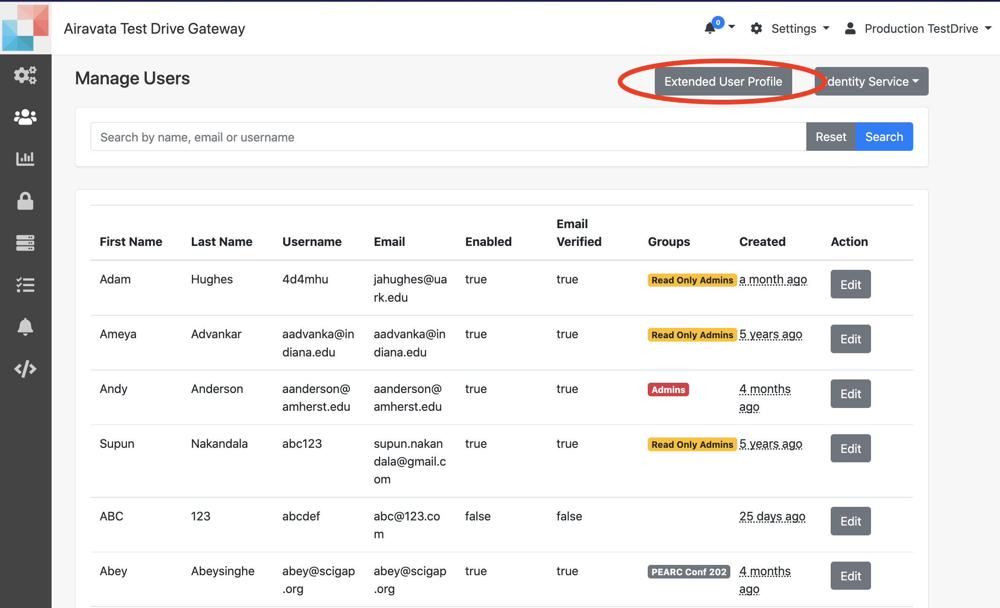
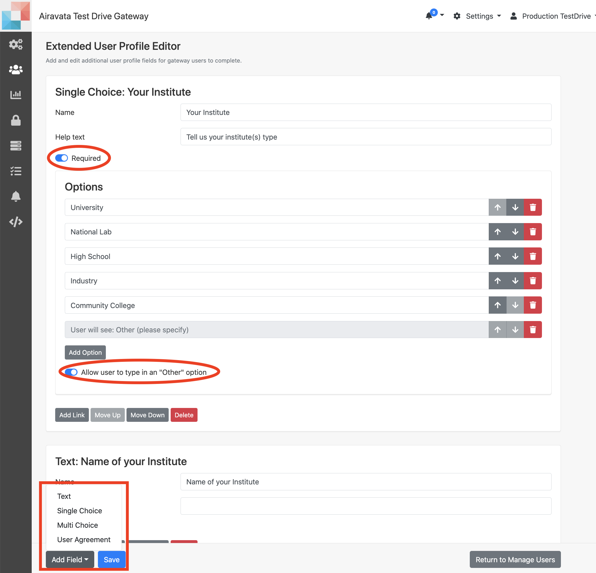
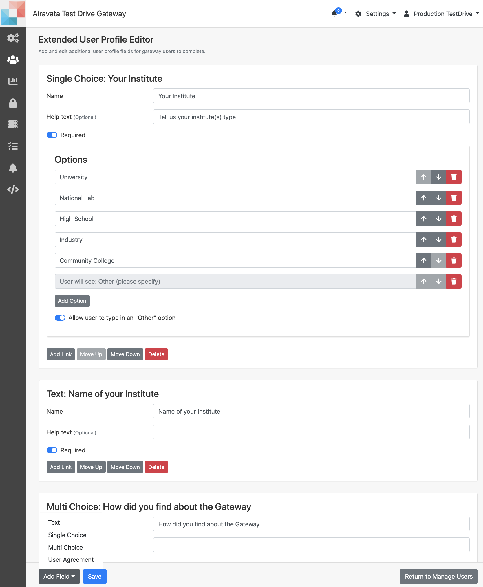
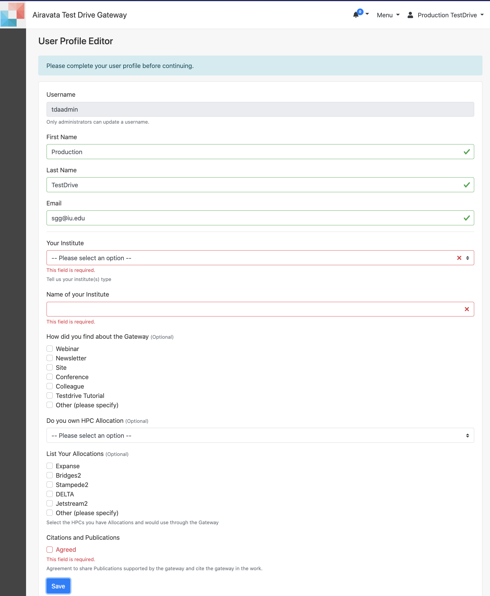

##Extended User Profile

1. This feature is for gateway admins/PIs to obtain more gateway user information.  The users will create the accounts by providing the minimum information on local account creation and also comes through CILogon. 
In both these the gateway admins will only know; 
    - First Name  
    - Last Name 
    - Email  
    
2. Manage Users page is for gateway admins to  
    - <a href= "#access">Enable the Feature</a> 
    - <a href= "#usefeature">Feature in Action</a> 

#####<h5 id="access">Enable the Feature</h5>
1. With the Extended User Profile Feature, you can add any additional information you would want to obtain from the user. This information would assist with better serving the gateways users. 
2. Navigate to **Settings** &rarr; **Manage Users** &rarr; **Extended User Profile** 

Image: Access Extended User Profile  

3. To enable the Extended User Profile, first you need to configure what information you require from the users. You can shape the questions, using fields; 
    - Single Choice 
    - Multiple Choice 
    - Text 
    - User Agreement 

Image: Options of Extended User Profile      
4. When adding above, you can state whether the information is required or optional. Optional information can be ignored by the user at will but the required information must be provided to gain access to the gateway. 
5. Gateway users, will be directed to complete the details of the extended user profile, upon login and will not be able to bypass, unless they provide the required details.  
6. The gateway admins can review and update the required information time to time and keep it upto date with details needed to capture from the users. 

Image: Configure Extended User Profile

#####<h5 id="usefeature">Feature in Action</h5>
1. Once the Extended User Profile details are configured, all gateway users will be directed to fill, except for admin users.  
2. The gateway admins will be notified about new user account creations only after the users fill the profile details and the provided details will be shared though an email. 
3. Users has the option of changing their profile detail through **User Settings**

Image: Capture Extended User Profile Information