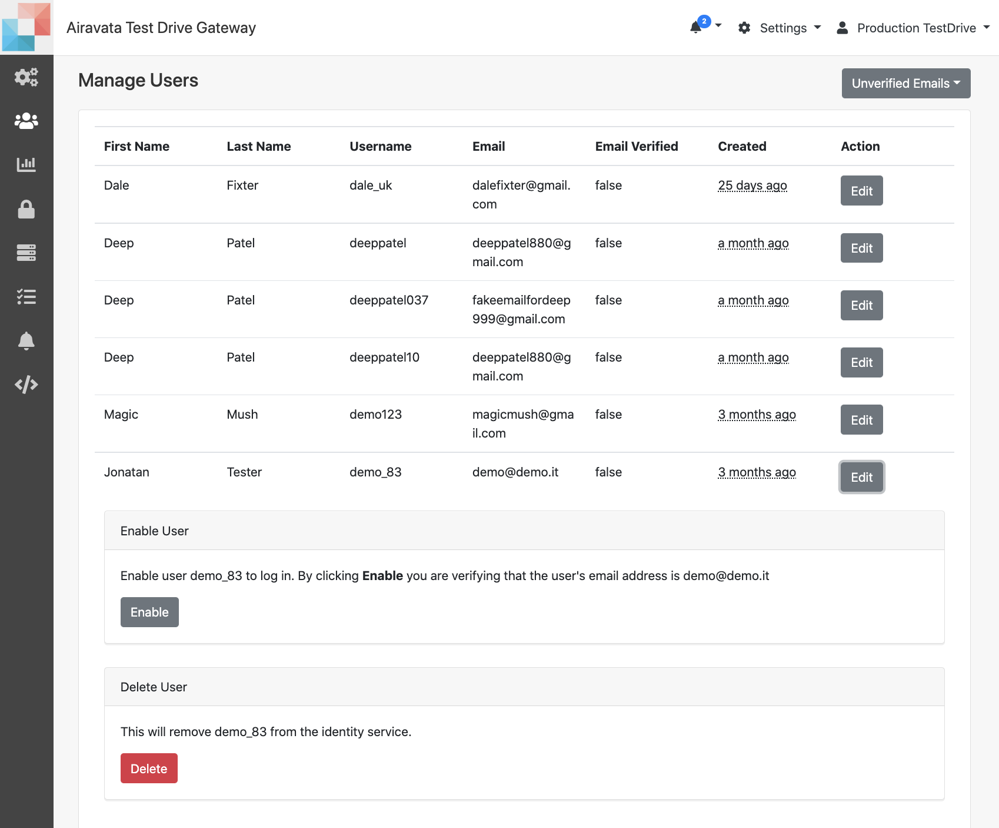

##Extended User Profile

This feature is for gateway admins/PIs to obtain more gateway user information.  The users will create the accounts by providing the minimum information on local account creation and also comes through CILogon. 
In both these the gateway admins will only know; 
    - First Name  
    - Last Name 
    - Email  
    
1. Manage Users page is for gateway admins to
    - <a href= "#access">How to Access the Feature</a> 
    - <a href= "#profilefix">Correct User Profile</a> 
    - <a href= "#adduser">Add users to Groups</a> 
    - <a href= "#removeuser">Remove users from Group</a> 
    - <a href= "#deleteuser">Delete Unverified Users</a> 

#####<h5 id="access">Enable the Feature</h5>
1. With the Extended User Profile Feature, you can add any additional information you would want to obtain from the user. This information would assist with better serving the gateways users. 
2. Navigate to **Settings** &rarr; **Manage Users** &rarr; **Extended User Profile**
3. To enable the Extended User Profile, first you need to configure what information you require from the users. You can shape the questions, using fields; 
    - Single Choice 
    - Multiple Choice 
    - Text 
    - User Agreement 
    
4. When adding above, you can state whether the information is required or optional. Optional inofrmation can be ignored by the user at will but the required information must be provided to gain access to the gateway. 
    
#####<h5 id="verificationoverride">Override Email Verification</h5>
1. This is applicable for users who crated local accounts providing their details.
2. Users have to verify their email, but in the case of email verification link is delayed, the gateway admin can override and enable the user.

<ADD>------

Image:Override Email Verification and Enable User

#####<h5 id="profilefix">User Profile Correction</h5>
1. When users use their existing institutional login, to create accounts sometimes gateway may not receive vital information such as first name, last name, email and rarely the username also not in the right format.
2. Such situations, gateway admin need to fix.
3. Gateway admin can add the first name, last name and set the username to the email linked to the institution selected.

<ADD>------

Image:User Profile Correction Tab

#####<h5 id="profilefix">User Profile Correction</h5>