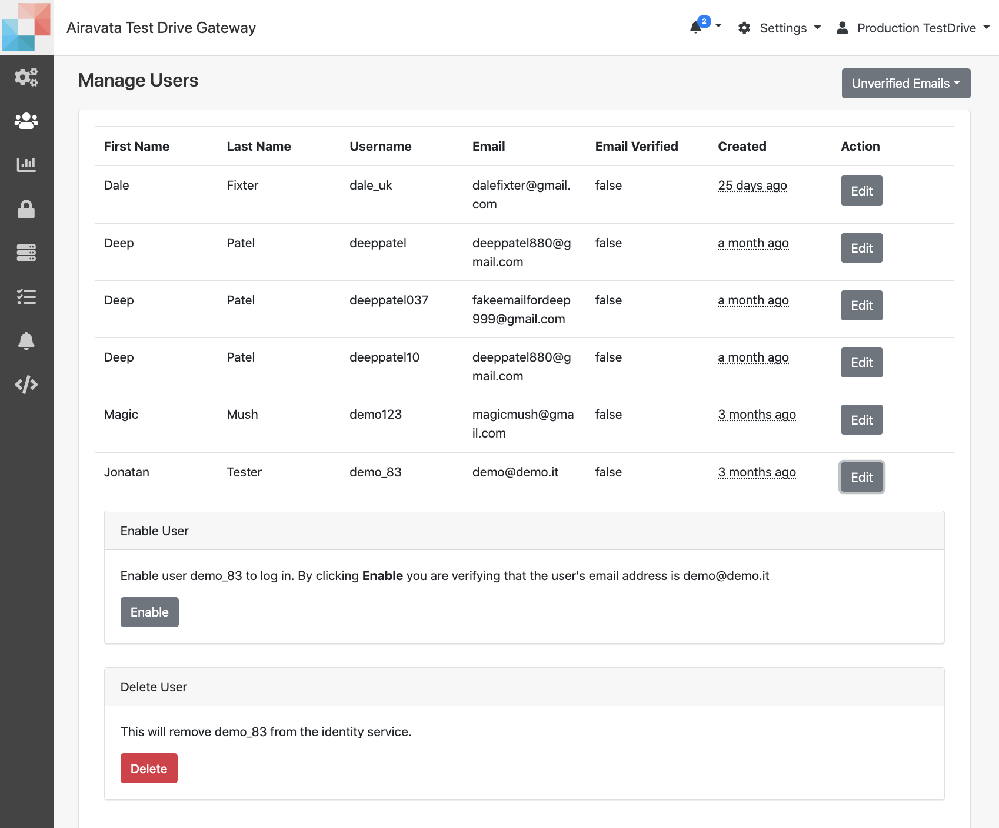
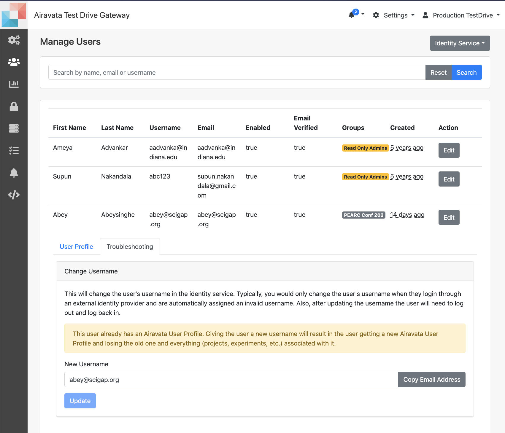

##Manage Users

1. Manage Users page is for gateway admins to
    - <a href= "#verificationoverride">Override Email Verification</a> 
    - <a href= "#profilefix">Correct User Profile</a> 
    - <a href= "#adduser">Add users to Groups</a> 
    - <a href= "#removeuser">Remove users from Group</a> 
    - <a href= "#deleteuser">Delete Unverified Users</a> 

#####<h5 id="verificationoverride">Override Email Verification</h5>
1. This is applicable for users who crated local accounts providing their details.
2. Users have to verify their email, but in the case of email verification link is delayed, the gateway admin can override and enable the user.

<ADD>------

Image:Override Email Verification and Enable User

#####<h5 id="profilefix">User Profile Correction</h5>
1. When users use their existing institutional login, to create accounts sometimes gateway may not receive vital information such as first name, last name, email and rarely the username also not in the right format.
2. Such situations, gateway admin need to fix.
3. Gateway admin can add the first name, last name and set the username to the email linked to the institution selected.

<ADD>------

Image:User Profile Correction Tab

#####<h5 id="profilefix">User Profile Correction</h5>