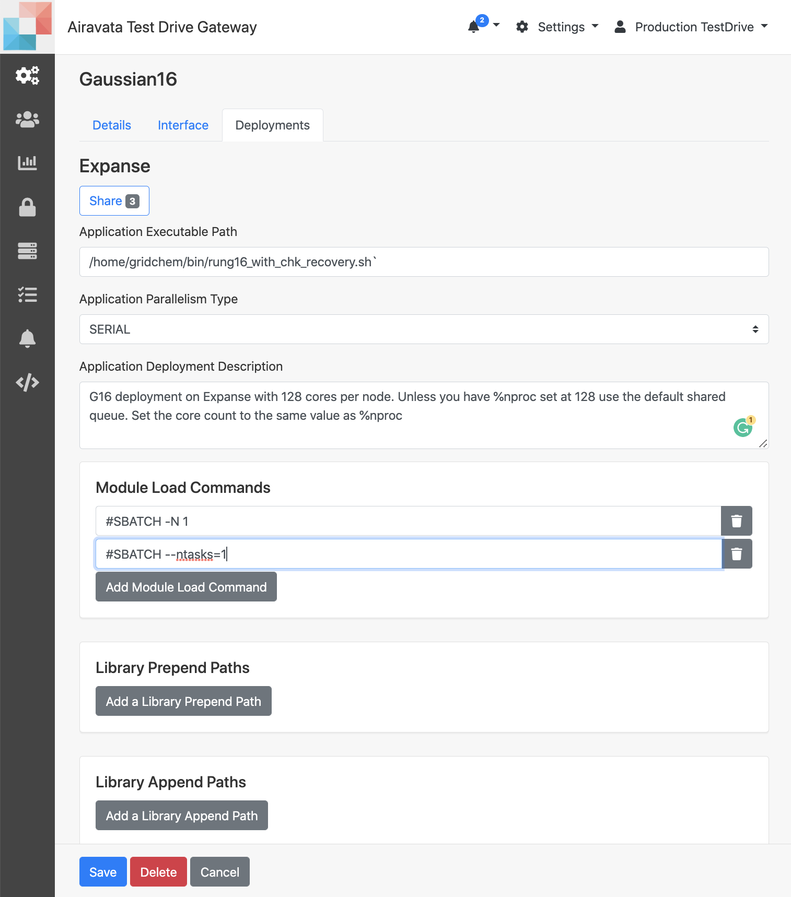
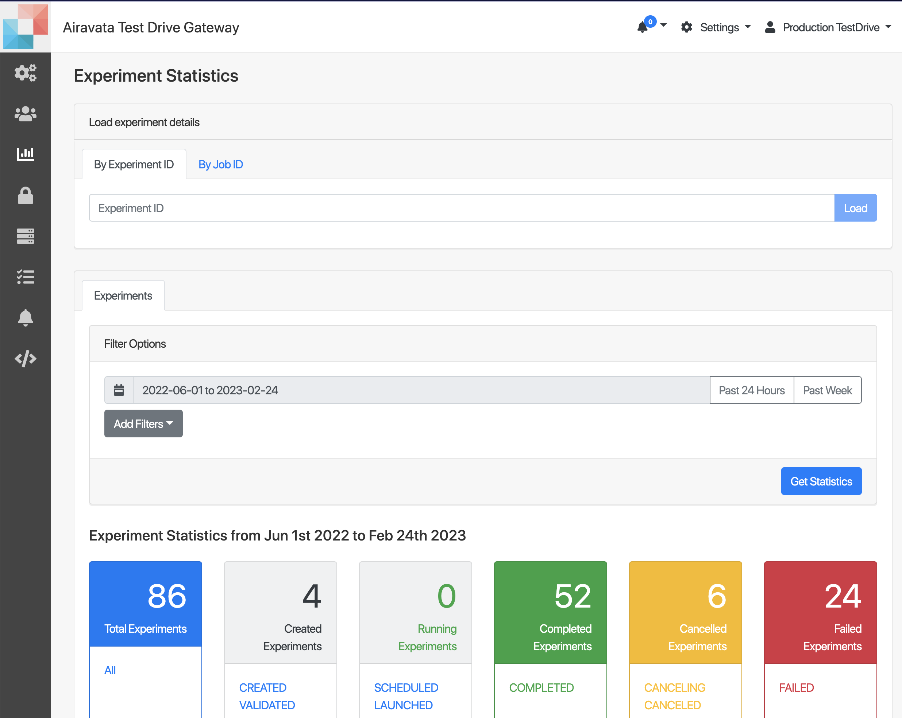

## Quick Start Steps for Admins

This is for quick intro for most common tasks carried out by gateway admins.
  
- <a href= "#addapplication">Add New Application</a>  
- <a href= "#chkexpstatus">Check Experiment Status</a> 
- <a href= "#manageusers">Manage Users</a>  

##### <h5 id="addapplication">Create New Application</h5>
1. **Settings** &rarr; **Application Catalog** &rarr; **New Application+**
2. In the first _Details_ tab provide the 
    - Name (Mandatory)
    - Version (Optional)
    - Description (Optional)
3. Upon saving, the next two tabs (Interface & Deployment) will be accessible. 
4. The _Interface_ tab is where you would add the application inputs, These are the required inputs for the application to execute.

Image: Application Details

Image: Application Input Configuration

5. The _Interface_ is also the place to add any output file you would want to make available for users to download.

5. The _Deployment_ tab is to add all the details required to execute the application on the remote resource. This includes
    - application's executable path
    - commands to load any required modules 
    - Any environment variables
    - Pre and post job conditions
6. Plus you can set the default queue and its properties for users. You would choose the default queue and add default number of nodes, CPUs and walltime.
7. This is helpful for general user, as they can just use the default settings.
8. For more information refer: <a href="/user-documentation/application-catalog" target="_blank">Application Catalog</a> 
    
<ADD>-

Image: Application Deployment 

##### <h5 id="chkexpstatus">Check Experiment Status</h5>
1. This is one of the most used functions by gateway admins.
2. When a gateway user need help with a particular job or need to monitor the gateway job submission rate and their statuses admins use this.
3. **Settings** &rarr; **Experiment Statistics** (Third option in the left icon menu)
4. Here you can search a specific experiment with its job details using the experiment ID
5. It will retrieve experiment details, job details, statuses and all tha task statuses in he experiment life cycle.
6. It will also show you the job submission script generated to submit the job and input files and output files. 
7. Most importantly, this will show you if an error occurred the error messages and exactly which task failed.
8. This will also list job submission responses from the remote resource and that usually gives a clue if something went wrong with job at the remote resource.

Image: Experiment Statistics for an Experiment

9. Gateway admins can use _**Experiment Statistics**_ to get an general idea of the experiment statuses.
10. The page will show by default the total number of experiments and their statuses for the last 2 hours.
11. Gateway admins can view experiment status for either 24 hours or for the last week or can give the period of choice using the calendar option. Can also use extra filters;
    - Application Name
    - User Name
    - Compute Resource
e.g. Retrieve all experiment from Mar/01/2022 - Jun/01/2022 submitted to Expanse resource.

##### <h5 id="manageusers">Manage Users</h5>
1. **Settings** &rarr; **Manage Users**
2. You can search gateway user sand add or remove them from gateway user groups.
3. Gateway admins mostly use this to enable users on the gateway.
4. As an gateway admin you can add users to any base group (admin, read-only-admin or general) 
5. If you have other admin groups created within the gateway, you can add users to them as well.
6. Just like adding users, you can remove users from the group either to revoke gateway access from base group or any other admin groups in the gateway.

<ADD>-

Image: Manage Users

    

