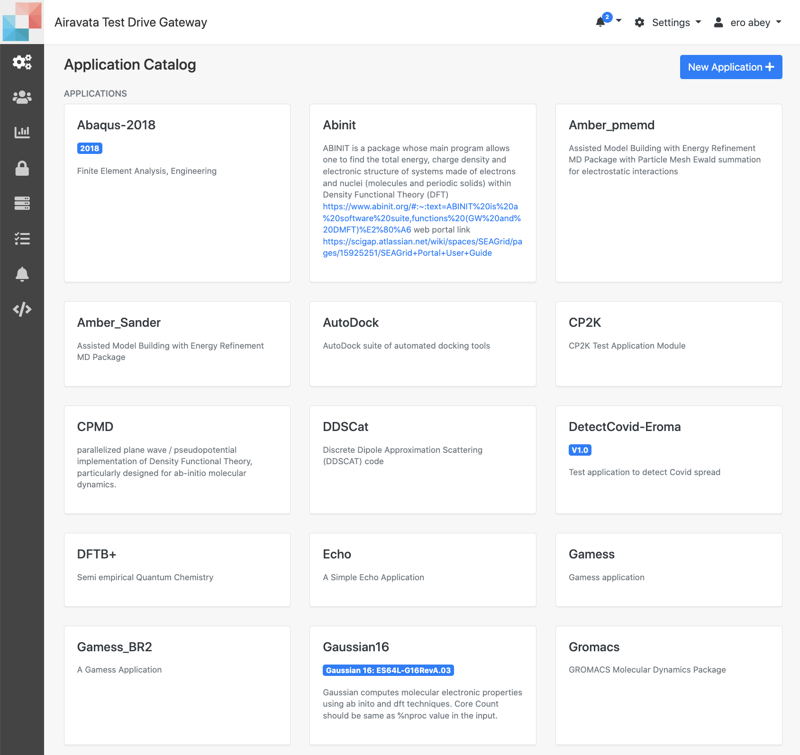
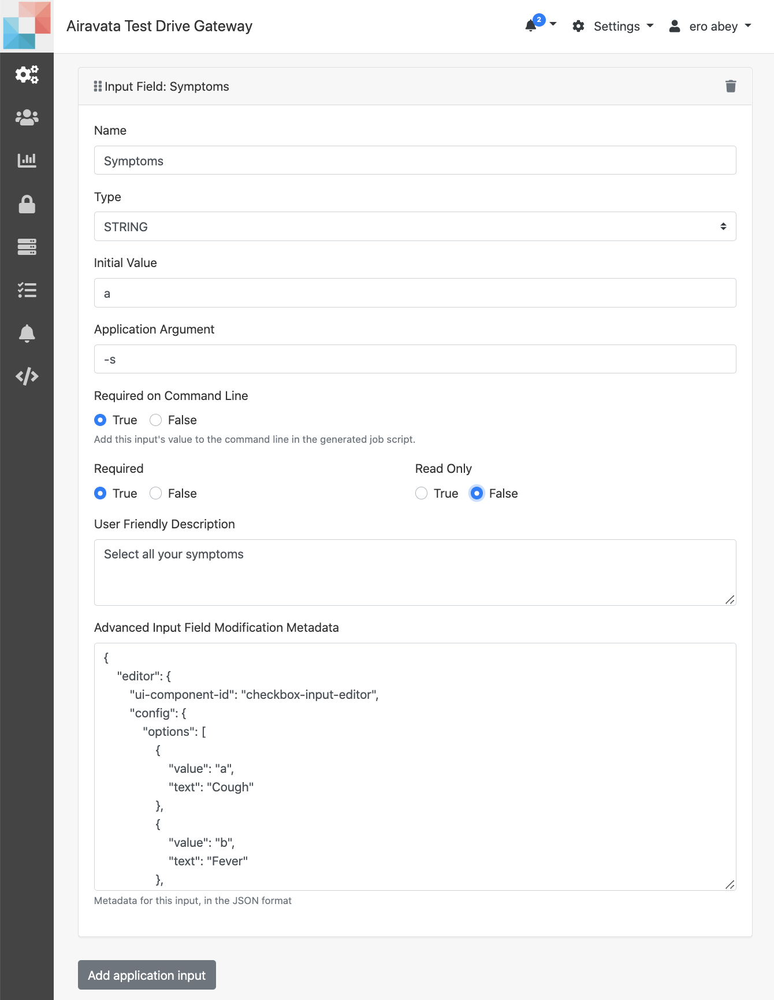
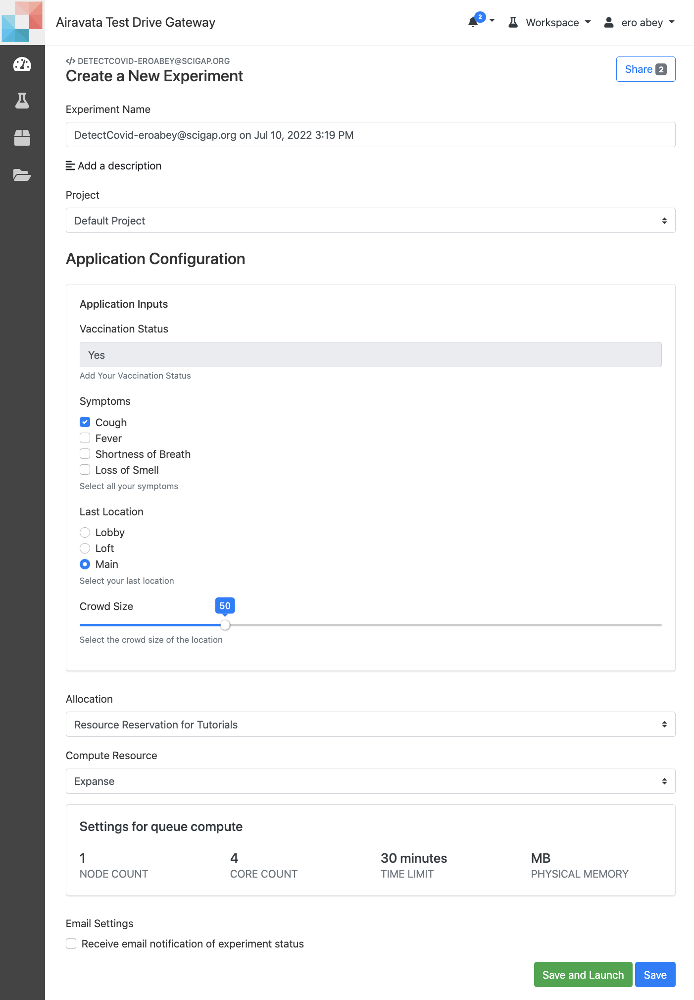

## Admin Tutorial Hands on: Create an Application with Advance Input Components 
- Section covered;
    - <a href= "#access">Get Access</a></br>
    - <a href= "#create">Create a New Application</a></br> 
    - <a href= "#addint">Add Application Interfaces</a></br>
    - <a href= "#addappdep">Add Application Deployment</a></br>
    - <a href= "#more">More Details On...</a></br>

#####<h5 id="access">Getting Access</h5>
1. Log into <a href="https://testdrive.airavata.org/" target="_blank"><b>TestDrive Portal</a></b>
<br></br>
2. First, you'll need a user account. <a href="https://testdrive.airavata.org/auth/login" target="_blank"><b>Create an account</a></b> using your existing institutional login through CILogon. 
<br></br>
3. After you've logged in, an administrator will grant you access to create the test application _**DetectCovid**_. 
<br></br>
4. When you log in for the first time you will be in the 'Workspace'. Switch to 'Settings'
<br></br>
5. 'Settings' is the admin space of the gateway. Here the first is "Application Catalog"
<br>NOTE: the purpose of this hands on is to demonstrate some of the advance application input options available in the gateway.


Image: Application Catalog

#####<h5 id="create">Create New Application "DetectCovid"</h5>
1. Application Catalog is where all the available applications are listed as well as the option to create new.
<br></br>
2. Use _New Application+_ to create new application.
<br></br>
3. In the 'Details' tab provide the name, version and description.
      - Application Name: DetectCovd-Peter
      - Application Version: V1.0 
      - Application Description: Test tutorial application to detect Covid spread
<br></br>
4. For _Application Name_ provide `DetectCovid-<your name>`. Appending your
     name will allow you to distinguish your version of _**DetectCovid**_ from other
     users.
     <br> e.g. DetectCovid-Peter
<br></br>

Image: Application Details Tab
<br></br>

5. Upon saving the _Details_ users can add _Interface_ and _Deployment_ of the application in respective tabs.

#####<h5 id="addint">Add Application Interfaces</h5>

1. Click on the **Interface** tab.
<br></br>
2. Click button, _Add application input_.
<br></br>
3. Add the first Application Input
    - _Name_: Vaccination Status
    - _Type_: String
    - _Initial Value_: Yes
    - _Application Argument_: `-v`
    - _User Friendly Description_: `Add your Vaccintion Status`
    - _Required on Command Line_: `True`
    - _Required_: `True`
    - _Read Only_: `False`
    
4. Add the second Application Input
    - _Name_: Symptoms
    - _Type_: String
    - _Initial Value_: a
    - _Application Argument_: `-s`
    - _User Friendly Description_: `Select all your symptoms`
    - _Required on Command Line_: `True`
    - _Required_: `True`
    - _Read Only_: `False`
    - _Advanced Input Field Modification Metadata_: 


<button class="btn" data-clipboard-target="#symptoms">
    Copy to clipboard
</button>
<div id="symptoms">
```json    
{
    "editor": {
        "ui-component-id": "checkbox-input-editor",
        "config": {
            "options": [
                {
                    "value": "a",
                    "text": "Cough"
                },
                {
                    "value": "b",
                    "text": "Fever"
                },
                {
                    "value": "c",
                    "text": "Shortness of Breath"
                },
                {
                    "value": "d",
                    "text": "Loss of Smell"
                 }
            ]
        }
    }
}
``` 
</div>   


Image:DetectCovid Checkbox Input

4. Add the third Application Input
       - _Name_: Last Location
       - _Type_: String
       - _Initial Value_: main
       - _Application Argument_: `-l`
       - _User Friendly Description_: `Select your last location`
       - _Required on Command Line_: `True`
       - _Required_: `True`
       - _Read Only_: `False`
       - _Metadata_

<button class="btn" data-clipboard-target="#last_location">
    Copy to clipboard
</button>
<div id="last_location">
```json
{
    "editor": {
        "ui-component-id": "radio-button-input-editor",
        "config": {
            "options": [
                {
                    "value": "lobby",
                    "text": "Lobby"
                },
                {
                    "value": "loft",
                    "text": "Loft"
                },
                {
                    "value": "main",
                    "text": "Main"
                }
            ]
        }
    }
}
```
</div>

5. Add the last Application Input
       - _Name_: Crowd Size
       - _Type_: String
       - _Initial Value_: 50
       - _Application Argument_: `-cd`
       - _User Friendly Description_: `Select the crowd size of the location`
       - _Required on Command Line_: `True`
       - _Required_: `True`
       - _Read Only_: `False`
       - _Metadata_

<button class="btn" data-clipboard-target="#crowd_size">
    Copy to clipboard
</button>
<div id="crowd_size">
```json 
{
    "editor": {
        "ui-component-id": "slider-input-editor",
        "config": {
            "min": 0,
            "max": 200,
            "step": 10,
            "valueFormat": {
                "percentage": false
            },
            "displayFormat": {
                "percentage": false
            }
        }
    }
}
```
</div>

6. In the interface tab, you can also add any output you explicitly wants to  bring back from the remote resource and make available for the gateway users to download, for this tutorial, we will not be adding outputs. 
7. After you added all the above inputs, the experiment creation page would look like below;


Image:Create DetectCovid Experiment

#####<h5 id="addappdep">Add Application Deployment</h5>
1. The Application **Deployment** is where we add command to execute the computation in a specific remote computational resource.

2. Choose _Expanse_ as the compute resource.

3. For this tutorial, In the Deployment tab, as the _executable path_ add `\executable path`

4. Ignore rest of the fields and save.

5. NOTE: This application is purely to demonstrate the application input options and not to actually submit and run on a resource. 
<br></br>

#####<h5 id="more">More Details On...</h5>
1. <a href="/user-documentation/application-catalog" target="_blank">Creating Applications</a>
2. <a href="/user-documentation/advance-inputs" target="_blank">Advance Input Options</a>