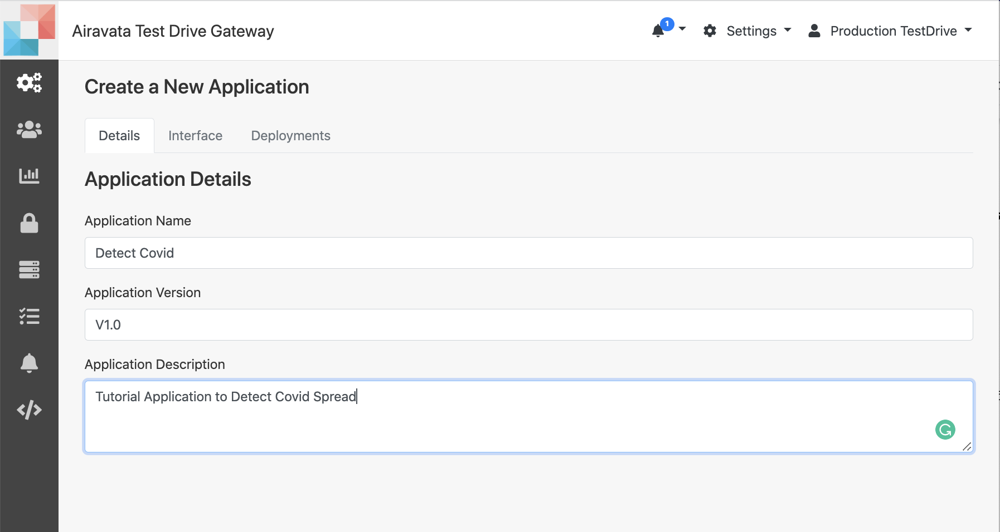

## Admin Tutorial Hands on: Create an Application with Advance Input Components 

1. Log into <a href="https://testdrive.airavata.org/" target="_blank">TestDrive Portal</a>
<br></br>
2. First, you'll need a user account. <a href="https://testdrive.airavata.org/auth/login" target="_blank">Create an account</a> using your existing institutional login through CILogon. 
<br></br>
3. After you've logged in, an administrator can grant you access to run the Gaussian16 application. 
<br></br>
4. During the tutorial we'll grant you access right away and let you know. 
<br></br>
5. When you log in for the first time you will be in the 'Workspace'. Switch to 'Settings'
<br></br>
6. 'Settings' is the admin space of the gateway. Here the first is "Application Catalog"
<br></br> 

NOTE: the purpose of this hands on is to demonstrate some of the advance application input options available in the gateway.

#####Create New Application "Detect Covid"
1. Application Catalog is where all the available applications are listed as well as the option to create new.
<br></br>
2. Use "New Application" to create new application.
<br></br>
3. In the 'Details' tab provide the name, version and description.
<br></br>
4. For _Application Name_ provide `DetectCovid-<your username>`. Appending your
     username will allow you to distinguish your version of _DetectCovid_ from other
     users.
<br></br>

Image: Application Details Tab
<br></br>
4. Upon saving the 'Details' users can add 'Interface' and 'Deployment' of the application in respective tabs.

#####Application Interface

1. Click on the **Interface** tab.
<br></br>
2. Add the first Application Input
    - _Name_: Vaccinated?
    - _Type_: String
    - _Initial Value_: Yes
    - _Application Argument_: `-v`
    - _User Friendly Description_: `Add your Vaccintion Status`
    - _Required_: `True`
    - _Required on Command Line_: `True`
    
3. Add the second Application Input
    - _Name_: Symptoms Exists?
    - _Type_: String
    - _Initial Value_: a
    - _Application Argument_: `-s`
    - _User Friendly Description_: `Select all your symptoms`
    - _Required_: `True`
    - _Required on Command Line_: `True`
    - _metadata_: 
<div id="target_id">
```json    
{
    "editor": {
        "ui-component-id": "checkbox-input-editor",
        "config": {
            "options": [
                {
                    "value": "a",
                    "text": "Cough"
                },
                {
                    "value": "b",
                    "text": "Fever"
                },
                {
                    "value": "c",
                    "text": "Shortness of Breath"
                },
                {
                    "value": "d",
                    "text": "loss of smell"
                 }
            ]
        }
    }
}
``` 
</div>   

4. Add the third Application Input
       - _Name_: Last Location
       - _Type_: String
       - _Initial Value_: main
       - _Application Argument_: `-l`
       - _User Friendly Description_: `Select your last location`
       - _Required_: `True`
       - _Required on Command Line_: `True`
       - _Metadata_
<div id="target_id">
```json
{
    "editor": {
        "ui-component-id": "radio-button-input-editor",
        "config": {
            "options": [
                {
                    "value": "lobby",
                    "text": "Lobby"
                },
                {
                    "value": "loft",
                    "text": "Loft"
                },
                {
                    "value": "main",
                    "text": "Main"
                }
            ]
        }
    }
}
```
</div>

5. Add the last Application Input
       - _Name_: Crowd Size
       - _Type_: String
       - _Initial Value_: 50
       - _Application Argument_: `-cd`
       - _User Friendly Description_: `Select the crowd size of the location`
       - _Required_: `True`
       - _Required on Command Line_: `True`
       - _Metadata_
<div id="target_id">
```json 
{
    "editor": {
        "ui-component-id": "slider-input-editor",
        "config": {
            "min": 0,
            "max": 200,
            "step": 10,
            "valueFormat": {
                "percentage": false
            },
            "displayFormat": {
                "percentage": false
            }
        }
    }
}
```
</div>